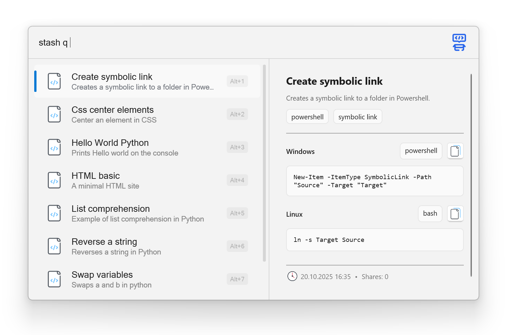
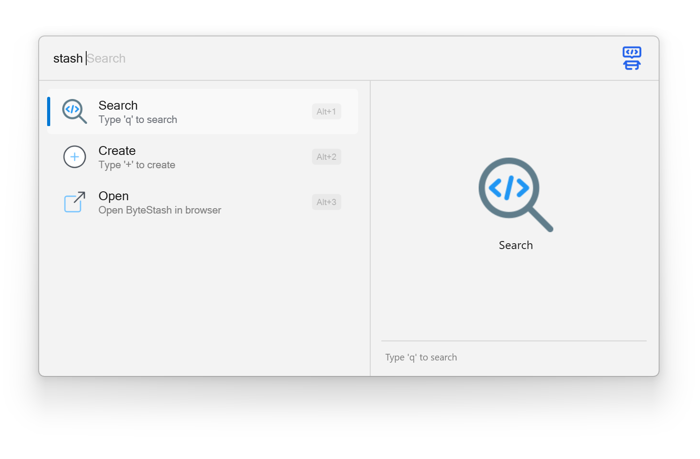
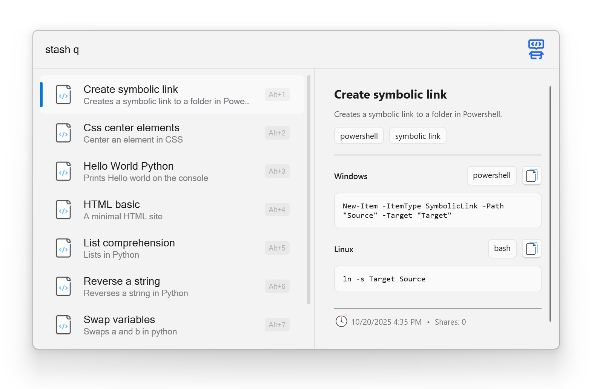
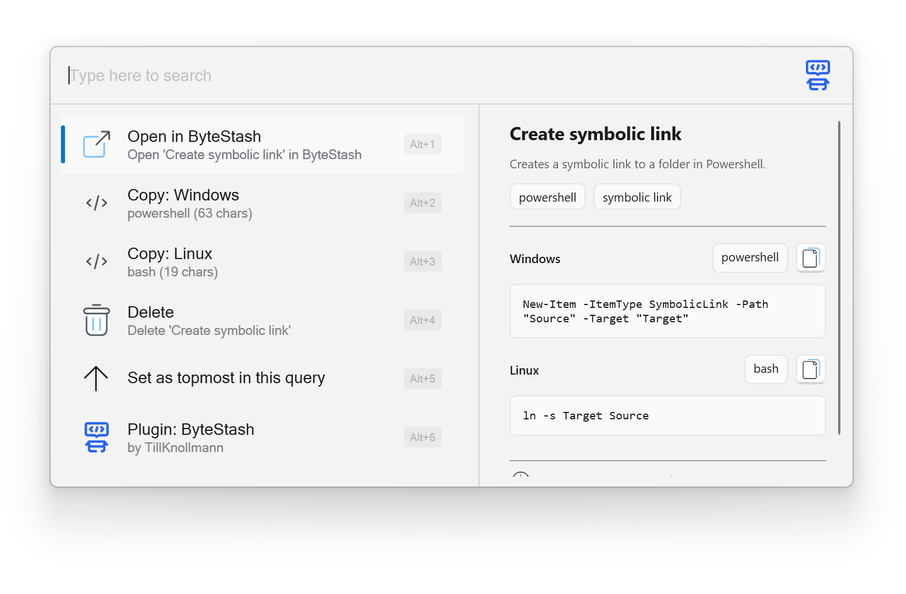

:toc: macro
:toclevels: 3
:icons: font
:source-highlighter: rouge

++++

++++

= Byte Stash Plugin for FlowLauncher

A powerful https://www.flowlauncher.com/[FlowLauncher] plugin for managing and accessing your code snippets stored in https://github.com/jordan-dalby/ByteStash[ByteStash] directly from your launcher.

The plugin seamlessly integrates your ByteStash snippet collection with FlowLauncher, enabling you to search, create, and manage your code snippets without leaving your workflow.

toc::[]
:toclevels: 3

== Installation

=== Prerequisites

* https://www.flowlauncher.com/[FlowLauncher] installed on Windows
* A running https://github.com/jordan-dalby/ByteStash[ByteStash] instance (self-hosted or cloud-based)

=== Install via FlowLauncher

. Open FlowLauncher
. Type `pm install Byte Stash`
. Press Enter to install the plugin
. Restart FlowLauncher if prompted

=== Manual Installation

. Download the latest release from the https://github.com/TillKnollmann/Flow.Launcher.Plugin.ByteStash/releases[GitHub Releases page]
. Extract the ZIP file to your FlowLauncher plugins directory:
+
[source]
----
%APPDATA%\FlowLauncher\Plugins\Byte Stash-{version}
----
. Restart FlowLauncher

== Configuration

After installation, you need to configure the plugin with your ByteStash connection details:

. Open FlowLauncher Settings (type `settings` in FlowLauncher)
. Navigate to the *Plugins* section
. Find *Byte Stash* in the plugin list
. Configure the following settings:
+
[cols="1,3"]
|===
|Setting |Description

|*Base URL*
|The base URL of your ByteStash instance (e.g., `https://bytestash.example.com`)

|*API Key*
|Your ByteStash API key for authentication

|*Search in Code*
|Enable this option to search within snippet code in addition to titles and descriptions
|===

== Usage

The plugin is activated using the action keyword `stash` in FlowLauncher.

=== Basic Usage Pattern

[source]
----
stash <command> [parameters]
----

=== Available Commands

==== Search Snippets

Search for snippets in your ByteStash collection.

[source]
----
stash q <search term>
----

* _Enter_: Copy the first code fragment to clipboard
* _Right-click_ or _Shift+Enter_: Open context menu with additional actions

[.center.text-center]

==== Create Snippets

Create new snippets directly from FlowLauncher.

[source]
----
stash + <title> | <description> | <categories> | <code>
----

[cols="1,3"]
|===
|Parameter |Description

|`title`
|Title of the snippet (required)

|`description`
|Description of the snippet (optional)

|`categories`
|Comma-separated list of categories (optional)

|`code`
|Code content. If omitted, uses clipboard content
|===

[.center.text-center]

==== Delete Snippets

Delete snippets from your ByteStash collection.

. Search for a snippet using `stash q <search>`
. _Right-click_ or press _Shift+Enter_ on the snippet
. Select "Delete snippet" from the context menu
. Confirm the deletion

[.center.text-center]

== Context Menu Actions

_Right-click_ or press _Shift+Enter_ on any snippet to access:

* *View in ByteStash*: Opens the snippet in your ByteStash web interface
* *Copy Code (Fragment)*: Copy individual code fragments (for multi-fragment snippets)
* *Delete Snippet*: Remove the snippet from your collection

[.center.text-center]

== Troubleshooting

=== Connection Issues

If you experience connection problems:

. Verify your Base URL is correct and accessible
. Check your API key is valid
. Ensure your ByteStash instance is running
. Check firewall settings if using a self-hosted instance

=== Invalid Settings Warning

If you see an "Invalid settings" message:

. Open plugin settings
. Verify both Base URL and API Key are configured

== Attributions

This plugin makes use of the following resources:

* *https://github.com/jordan-dalby/ByteStash[ByteStash]*: The snippet management system this plugin connects to
* *https://icons8.com[Icons8]*: Icons used in the plugin interface

Special thanks to the ByteStash team for creating an excellent snippet management platform!

== Contributing

Contributions are welcome! Please feel free to submit issues or pull requests on the https://github.com/TillKnollmann/Flow.Launcher.Plugin.ByteStash[GitHub repository].

== Support

For issues, feature requests, or questions, open an issue on https://github.com/TillKnollmann/Flow.Launcher.Plugin.ByteStash/issues[GitHub Issues].

== License

This project is licensed under the GNU General Public License v3.0 (GPL-3.0).

For more information about the GPL-3.0 license, visit: https://www.gnu.org/licenses/gpl-3.0.html

== Links

* *FlowLauncher*: https://www.flowlauncher.com/
* *ByteStash*: https://github.com/jordan-dalby/ByteStash

---

Made with ❤️ for the FlowLauncher and ByteStash communities
